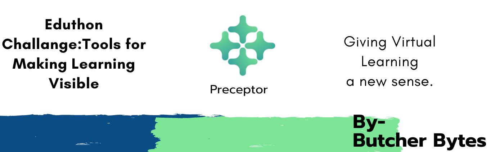
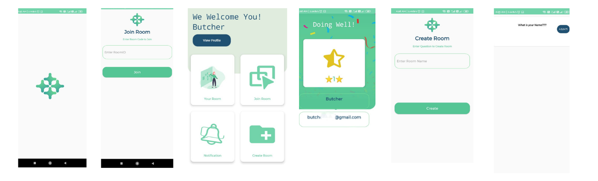

  

<h1 align="center">
  Preceptor
</h1>

## About Preceptor

-The app that let teachers know their students progress and their involvement in a virtual or online class.An interaction or a discussion app between the teacher and the student that helps the teacher understand about the clear-learning of the students.

# ScreenShots

  

# Eduthon Challange :

- Tools for Making Learning Visible

# Proposed Solution

The online education has become a challange and the teachers cannot understand how much knowledge has been gained by the students so we should have a platform where the teacher can get an idea of the understanding of the student based on their answers and involvement.With which Students are awarded with ⭐⭐

# How to Download Preceptor?

Link : https://drive.google.com/file/d/1bLe8sqUqQDa0R9zs_sFfCmmlhdXDkzo0/view?usp=sharing

# How to Use Preceptor?

- Step-1: Download the App
- Step-2: If you are an existing user then login with your details else signup.
- Step-3:If you are a teacher then create room and if a student then join the room.
- Step-4: Now the teachers will post the query and students will answer accordingly.
- Step-5:Students will be rated by their answers which will be reflected on their profile.

# For More Detailed Steps Visit :[My Youtube Channel](https://youtu.be/MxHKEbrraaw)

## Developers

### Team Butcher Bytes

- 🧒🏻 Rhythm Verma [github](https://github.com/ritmojs)
- 👩🏻 Gargi [github](https://github.com/gargijs)

# ThankYou

<h1 align="center">
   © Preceptor 2020
</h1>
